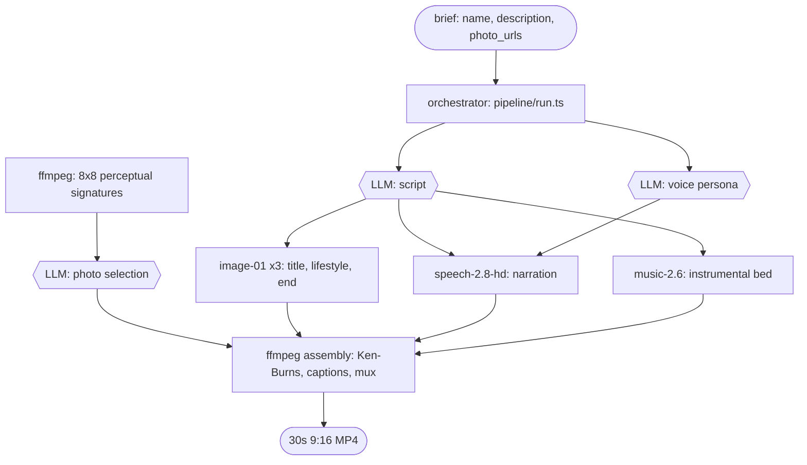

# Lensbnb

> Brief to 30-second 9:16 reel. MCP-native. MiniMax full stack. MIT.

## What it is

Lensbnb turns a content brief — name, markdown description, real photo URLs — into a 30-second vertical reel: script, image cards, voice, music, captions, watermark, and `ffmpeg` assembly. Every modality runs on MiniMax with one Bearer token. The bundled showcase is 20 Paris short-stay listings, but the same pipeline is exposed as a single MCP tool, `generate_reel`, that any client can call with any brief.

## Showcase: short-stay reels

Run the web app and twenty Paris listings render as 4:5 cards in a responsive grid. Click a card and the pipeline kicks off for that one listing; a status pill ticks through `script → images → voice → music → assembly` while you wait. ~3 minutes later the card swaps to a playable MP4 with caption, and a "How this reel was made" disclosure that exposes the script-retry count, the voice persona M2 picked for that listing, and the photo positions M2 chose from the candidate gallery.

Each reel is grounded in the listing's real markdown description and real photo gallery. The script prompt is grounded on the listing description and explicitly forbids invented amenities, views, or neighborhoods. Real photos drive the Ken-Burns sequence; M2-generated mood images bookend the real-photo sequence, with one lifestyle transition before the end card.

## Why it works

Marketing is the modern moat for small operators. Most teams cannot run a content engine that produces on-brand video at the speed AI writes prose, across all five modalities (script, image, voice, music, motion). Lensbnb is that engine — one MCP tool, end-to-end, with the agentic taste decisions visible in the output so the operator can trust it. Fork it, edit `prompts/script.md` for your domain, and ship.

## How it works



The orchestrator (`pipeline/run.ts`) is plain TypeScript. Hexagons in the diagram mark LLM-driven decisions — three of them, all `MiniMax-M2`. Rectangles are non-LLM calls: MiniMax media APIs (`image-01`, `speech-2.8-hd`, `music-2.6`) and `ffmpeg`. The stadium shapes are input and output. Persisted state lands in Supabase Postgres (`listings`, `reels`) and Storage (`listing-photos`, `reels`, `intermediates`).

## Agentic decisions

Three decisions are LLM-driven; everything else is glue.

- **Script** (`MiniMax-M2`): picks title, ALL-CAPS hook, 65–100 word narration, three image prompts, music prompt, caption, 5 hashtags. A validator checks word counts, caps, and hashtag prefixes; on failure the prompt is reissued with the failure list inlined, up to 2 retries (`pipeline/generate-script.ts:92`).
- **Voice persona** (`MiniMax-M2`): picks 1 of 4 from a hard-coded catalog (trustworthy man, Aussie bloke, wise woman, sweet female) plus a one-sentence rationale (`pipeline/select-voice.ts:23`). LLM returns a number 1–4, never a string ID it could hallucinate.
- **Photo selection** (`MiniMax-M2`): `ffmpeg` produces an 8×8 grayscale perceptual signature per candidate, code clusters by Hamming distance (threshold 0.20), then M2 picks 5 positions across clusters with rationale (`pipeline/select-photos.ts`). Three-tier fallback: LLM → stride → first-N.

Every decision and its rationale lands in `reels.script_json.meta` and surfaces in the UI's "How this reel was made" disclosure.

### Built for failure

- Schema validator with retry-and-feedback loop in `pipeline/generate-script.ts:92`.
- Three-tier JSON parse recovery for M2's occasional control-char output in `pipeline/generate-script.ts:46`.
- Three-tier photo selection (LLM → stride → first-N) in `pipeline/select-photos.ts:128`.
- Unit tests in `pipeline/__tests__/` and `adapters/airbnb/__tests__/`; integration tests in `scripts/test-mcp-lifecycle.ts` and `scripts/test-mcp-e2e.ts`.

## Use it as an MCP tool

Lensbnb ships a stdio MCP server (`mcp/server.ts`, name `lensbnb` v0.1.0) that exposes one tool, `generate_reel`. Any stdio MCP client can call it: Claude Desktop, the MCP Inspector, or your own client wired to `bun run mcp/server.ts`.

The default `prompts/script.md` is short-stay-tuned (hook → walk-through → neighborhood → close). For non-real-estate domains, edit the prompt file directly or use the web app's `/settings` page; the next reel picks up the change without a restart. Per-domain presets are on the roadmap.

### Tool signature

```jsonc
// generate_reel — params
{
  "brief": {
    "name": "string",                  // required
    "description": "string (markdown)", // required, M2 uses ONLY facts in here
    "photo_urls": ["string"],          // required, minItems 1; 8-15 recommended
    "external_url": "string?",
    "city": "string?",
    "neighborhood": "string?"
  },
  "taste":   { "target_seconds": 30 }, // soft hint; v0.1 always targets ~30s
  "options": { "include_watermark": true } // default true; reads brand/branding.json
}

// generate_reel — return
{
  "mp4_url": "https://.../reel.mp4",
  "duration_s": 30,
  "caption": "string",
  "hashtags": ["#..."],
  "generation_log": {
    "voice_id": "English_Trustworth_Man",
    "voice_rationale": "string",
    "music_mood": "string",
    "photo_selection": {
      "chosen_positions": [0,3,5,7,9],
      "candidates_total": 13,
      "candidates_uncapped": 13,
      "method": "llm",
      "rationale": "..."
    },
    "retry_count": 0,
    "validation_failures": []   // string[][] — one inner array per attempt
  }
}
```

The call is synchronous and takes 3–5 minutes. The MCP transport returns a single text content block; the body is a stringified JSON object with the shape above. Every agentic decision (voice pick, photo pick, script retries) lands in `generation_log` so the caller can show its work.

### Claude Desktop config

Edit `~/Library/Application Support/Claude/claude_desktop_config.json` (macOS) or the platform equivalent:

```json
{
    "mcpServers": {
        "lensbnb": {
            "command": "bun",
            "args": ["run", "/absolute/path/to/lensbnb/mcp/server.ts"],
            "env": {
                "MINIMAX_API_KEY": "...",
                "SUPABASE_URL": "...",
                "SUPABASE_SERVICE_ROLE_KEY": "...",
                "SUPABASE_ANON_KEY": "..."
            }
        }
    }
}
```

Those four vars are what `pipeline/config.ts` reads at startup. The same vars need to live in `.env` if you run the server (or any pipeline script) outside Claude Desktop.

## Beyond real estate

The MCP server registers four read-only example briefs you can list and read before composing your own. Same pipeline, same tool, different domain — the only thing that changes is the brief and (optionally) the prompt at `prompts/script.md`.

| URI                                     | Topic                           | Photo source                | Photos |
| --------------------------------------- | ------------------------------- | --------------------------- | ------ |
| `lensbnb://example/airbnb-marais`       | Marais loft, river view (Paris) | Supabase mirror of muscache | 13     |
| `lensbnb://example/news-bees-pollinate` | Why bees pollinate food         | Wikimedia                   | 8      |
| `lensbnb://example/recipe-tarte-tatin`  | Tarte Tatin recipe              | Wikimedia                   | 8      |
| `lensbnb://example/oss-readme`          | OSS project intro template      | placehold.co colour blocks  | 6      |

`resources/list` returns them; `resources/read` returns the JSON brief. Pass any one to `generate_reel` and the pipeline runs as-is.

## Tech

| Layer          | Choice                                                                                 |
| -------------- | -------------------------------------------------------------------------------------- |
| Runtime        | Bun for scripts and MCP server, Node 22+ for the web app                               |
| Web framework  | Next.js 16.2.4 (App Router)                                                            |
| UI             | React 19.2.4, Tailwind 4                                                               |
| Data           | Supabase Postgres (`listings`, `reels`)                                                |
| Storage        | Supabase Storage (`listing-photos`, `reels`, `intermediates`)                          |
| MCP            | `@modelcontextprotocol/sdk` ^1.29.0 over stdio                                         |
| MiniMax models | `MiniMax-M2` (chat), `image-01` (9:16), `speech-2.8-hd` (TTS), `music-2.6` (music bed) |
| Media          | system `ffmpeg` + `ffprobe` compiled with `freetype` (for the `drawtext` filter)        |

## Run it

1. Install prereqs. Tested with Bun 1.3+, Node 22+. You also need ffmpeg compiled with `freetype` (Lensbnb uses the `drawtext` filter for captions), a Supabase project, and a MiniMax API key. The known-good install on macOS is the `homebrew-ffmpeg/ffmpeg` tap, which lists `freetype` as a default dependency:

    ```bash
    brew tap homebrew-ffmpeg/ffmpeg
    brew install homebrew-ffmpeg/ffmpeg/ffmpeg
    ffmpeg -filters | grep drawtext   # should print
    ```

    Then clone and install:

    ```bash
    git clone https://github.com/<you>/lensbnb && cd lensbnb && bun install
    ```

2. Copy `.env.example` to `.env` and fill in the keys the pipeline, MCP server, and web app actually read.

    ```bash
    cp .env.example .env
    ```

    Required: `MINIMAX_API_KEY`, `SUPABASE_URL`, `SUPABASE_SERVICE_ROLE_KEY`, `SUPABASE_ANON_KEY`, `SUPABASE_DB_URL`, `NEXT_PUBLIC_SUPABASE_URL`, `NEXT_PUBLIC_SUPABASE_ANON_KEY`. Optional: `MINIMAX_BASE_URL` (defaults to `https://api.minimax.io`), `INSIDE_AIRBNB_SNAPSHOT_DATE`.

3. Apply the Supabase migrations in order. `schema.sql` creates `listings` and `reels`, `storage-policies.sql` opens the three buckets the pipeline writes to (`listing-photos`, `reels`, `intermediates`), `seed.sql` plants one example listing.

    ```bash
    psql "$SUPABASE_DB_URL" -f supabase/schema.sql
    psql "$SUPABASE_DB_URL" -f supabase/storage-policies.sql
    psql "$SUPABASE_DB_URL" -f supabase/seed.sql
    ```

4. Add your brand assets, or generate placeholders for a demo. The pipeline reads `brand/lensbnb-logo.png`, `brand/lensbnb-mark.png`, and `brand/branding.json` (watermark corner, opacity, margin). Drop your own files in if you have them.

    ```bash
    bun run brand:generate    # only if you need placeholders
    ```

5. Seed Paris listings from Inside Airbnb. Pulls 20 listings (one per neighbourhood where possible) into Supabase and uploads exactly one hero photo per listing into the `listing-photos` bucket. To get richer galleries, run the optional expander step below.

    ```bash
    bun run adapter:airbnb
    ```

6. Start the web app. The dev server listens on http://localhost:3000; click **Generate** on a listing card to start a reel.

    ```bash
    cd examples/web && bun install && bun run dev
    ```

7. (Optional) Run the MCP server standalone over stdio for use from Claude Desktop or any MCP client.

    ```bash
    bun run mcp:server
    ```

### Refresh photo galleries (optional)

The default `adapter:airbnb` step uploads one hero photo per listing. If you want richer galleries (median 7–8, up to 16 candidates), run the expander after step 5. It uses `agent-browser` to open each listing, dismiss Airbnb's modals, click "Show all photos", and lazy-load the gallery.

```bash
bun run adapter:airbnb:expand
```

## Limitations

- **Default script prompt is short-stay-tuned.** `prompts/script.md` opens with "viral short-form content creator who specializes in short-stay rentals". A reel for a non-Airbnb topic will work, but the framing may leak (e.g. an "OSS project" reel ending with a booking-style CTA). Mitigation: edit `prompts/script.md` directly, or use the web app's `/settings` editor, before generating.
- **Single-city showcase dataset.** All 20 bundled listings are Paris; motifs (haussmannian windows, mansard roofs, "morning light over the Seine") can repeat across cards.
- **Mocked publish surface.** `POST /api/publish` returns `{ posted: true, mock: true }`. There is no live Instagram or TikTok integration.
- **Watermark is brand-global, not per-call.** It comes from `brand/branding.json` regardless of the `options.include_watermark` value the caller passes.
- **Synchronous MCP call, 3–5 minutes.** The tool returns when the MP4 is ready; there is no progress callback.
- **Photo-less topics need placeholders.** The `oss-readme` example uses `placehold.co` colour blocks because there are no real photos for "open source" as a concept. A `synthesize_photos` MCP tool is on the roadmap.

## Roadmap

- Per-domain prompt presets selectable from the settings page.
- `synthesize_photos` MCP tool: `image-01` plus Supabase upload, with a `forgery_advisory` knob so callers who must use real photos (real estate, product shots) can opt out of synthesis.
- Real Instagram and TikTok publish surface.
- Additional MCP surface: scheduled regeneration, completion webhooks, and `compose_brief` upgraded from a prompt to a tool.
- Captions from real TTS timestamps (`speech-2.8-hd` char/word timings or a WhisperX fallback) instead of heuristic narration splitting in `assemble-video.ts`.

## License

MIT, see [LICENSE](LICENSE).
